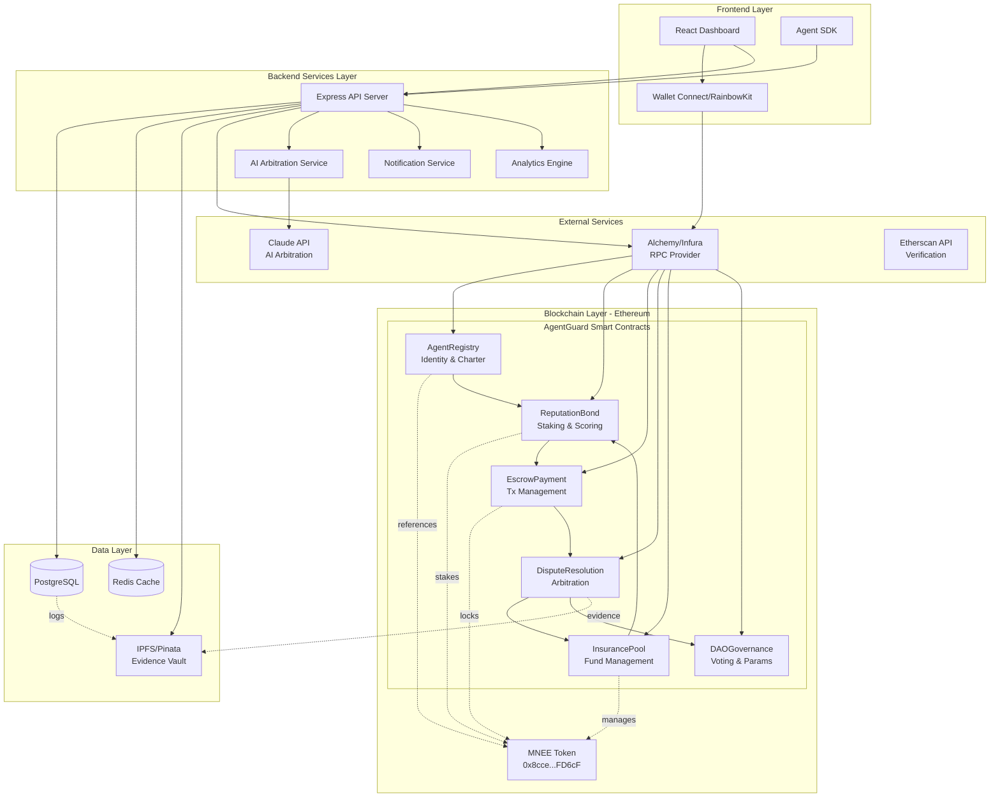

# AgentGaurd
The trust and insurance layer for AI agent commerce—making agent transactions safer than human purchases through bonded reputation, instant dispute resolution, and zero merchant chargeback risk.

Architecture
