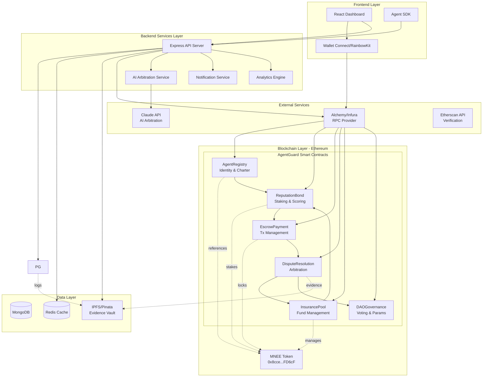

# AgentGuard
The trust and insurance layer for AI agent commerce—making agent transactions safer than human purchases through bonded reputation, instant dispute resolution, and zero merchant chargeback risk.

## Table of Contents
1. [The Problem](#the-problem)
2. [The Solution](#the-solution)
3. [Market Impact](#market-impact)
4. [How It Works: Technical Workflow](#how-it-works-technical-workflow)
5. [Technology Stack](#technology-stack)
6. [Ecosystem Importance](#ecosystem-importance)
7. [Real-World Usage Scenarios](#real-world-usage-scenarios)

## The Problem

### The Coming Agent Commerce Crisis

As AI agents become capable of autonomous transactions, the payments industry faces an existential crisis that threatens to derail the entire agent economy:

**1. The Liability Gap** 
- When an AI agent makes a purchase, who is responsible if it goes wrong?
- Current payment systems have no framework for "agent authorization" vs "user authorization"
- Credit card companies expect a 5-10% increase in chargebacks as agentic AI rolls out
- Merchants face unprecedented risk: customers can claim "I didn't buy that, my agent did!"

**2. The Trust Problem**
- Payment networks (Visa, Mastercard) are racing to build agent frameworks, but dispute resolution remains unsolved
- Merchants are hesitant to accept agent payments due to fraud concerns
- Users are hesitant to give agents payment access due to lack of safeguards
- No standardized way to verify an agent operated within authorized parameters

**3. The Coordination Nightmare**
- Agent transactions lack the audit trails and authorization proofs needed for disputes
- Traditional dispute resolution (60-120 days, $40+ per case) doesn't scale for high-frequency agent commerce
- Chargebacks cost the global economy $31 billion annually—AI agents could 10x this
- Without resolution infrastructure, the $250B+ agent economy will collapse under its own fraud weight

**4. The Merchant Dilemma**
- E-commerce platforms see agent commerce as the next frontier
- But accepting agent payments = accepting massive chargeback risk
- No insurance mechanism exists specifically for agent-initiated transactions
- Merchants must choose: miss the agent economy wave OR expose themselves to catastrophic losses

---

## The Solution

### AgentGuard: The Trust Layer for Autonomous Commerce

AgentGuard is an on-chain dispute resolution and insurance protocol specifically designed for AI agent transactions using MNEE stablecoin. We solve the agent commerce crisis through three core innovations:

**1. Cryptographic Authorization Framework**
- Every agent transaction includes immutable proof of authorization
- Agents register their "charter" on-chain: spending limits, allowed merchants, product categories, price thresholds
- Smart contracts enforce policy compliance before payment execution
- Transparent audit trail for every transaction decision

**2. Instant AI-Powered Dispute Resolution**
- When disputes arise, our arbitration protocol analyzes transaction metadata, agent authorization, and evidence
- Resolves 85% of disputes automatically in under 60 seconds
- Complex edge cases escalate to DAO governance (token-weighted voting)
- Clear, explainable reasoning for every decision

**3. Agent Reputation Bonds & Insurance Pools**
- Agents stake MNEE tokens into bonded insurance pools before transacting
- Reputation scores (0-1000) determine bond requirements and transaction fees
- Good agents pay 0.1% fees with minimal bonds; risky agents pay 2% with larger bonds
- Dispute payouts come from agent bonds, NOT merchant accounts = zero merchant chargeback risk
- Self-regulating marketplace where agents are incentivized to behave correctly

---

## Market Impact

### Why This Changes Everything

**For Merchants:**
- **Zero chargeback risk** when accepting agent payments (vs 0.6-1.2% for credit cards)
- Agent transactions become SAFER than human transactions
- Instant settlement in MNEE with 0.1-0.5% fees (vs 2.9% credit card fees)
- "AgentGuard Protected" badge increases conversion by signaling trust

**For Users:**
- Confidence to deploy agents with payment capabilities
- Transparent dispute resolution with clear evidence trails
- Protection from agent errors, hallucinations, or policy violations
- Insurance-backed guarantee on every transaction

**For AI Agents:**
- Clear operating boundaries and policy constraints
- Reputation building through successful transaction history
- Lower fees and higher limits as trust increases
- Standardized authorization framework across all merchants

**For the Ecosystem:**
- Unlocks the $250B+ agent commerce market by solving the trust problem
- Prevents the projected $1 trillion in agent-transaction disputes by 2027
- Creates first-mover standard for agent authorization and dispute resolution
- Establishes decentralized credit bureau for AI agents

**Economic Impact:**
- Reduces average dispute resolution time from 60-120 days to <60 seconds
- Cuts dispute resolution costs from $40+ per case to <$0.50
- Eliminates merchant chargeback losses (currently $31B annually)
- Enables high-frequency micro-transactions previously impossible with traditional dispute processes

---

## How It Works: Technical Workflow

### Core Architecture

```
User → Agent Registration → Authorization Charter → Transact → Escrow Period → 
Dispute Check → Resolution (AI or DAO) → Settlement
```


### Architecture


### Step-by-Step Flow

#### Phase 1: Agent Registration & Bonding

1. **User Creates Agent Identity**
   - Generate unique Decentralized Identifier (DID) for agent
   - User signs authorization creating agent's identity on-chain

2. **Define Agent Charter**
   - User specifies agent policies:
     - Spending limits (per transaction, daily, monthly)
     - Allowed merchant categories
     - Price ranges for product types
     - Blacklist/whitelist of specific merchants
   - Charter stored immutably on-chain with timestamp

3. **Stake Reputation Bond**
   - Agent (or user on behalf) stakes MNEE into insurance pool
   - Bond amount calculated based on spending limits and reputation score
   - New agents: Higher bond requirements (e.g., 5000 MNEE for $10k/month limit)
   - Veteran agents: Lower bonds (e.g., 500 MNEE for same limit if 950+ reputation)

4. **Receive Agent Credentials**
   - Agent gets cryptographic keys for signing transactions
   - Can now initiate payments through AgentGuard protocol

#### Phase 2: Transaction Execution

1. **Agent Initiates Purchase**
   - Agent finds product/service to purchase
   - Generates transaction request with metadata:
     - Item details, merchant ID, price in MNEE
     - Reference to agent charter
     - Agent signature proving authorization

2. **Policy Verification (Smart Contract)**
   - AgentGuard contract checks:
     - Does transaction match charter constraints?
     - Does agent have sufficient bond staked?
     - Is spending limit available?
   - If fails: Transaction rejected, agent notified
   - If passes: Proceed to escrow

3. **Escrow Payment**
   - MNEE transferred from user wallet to escrow contract
   - Funds locked for dispute period (default 24 hours, configurable)
   - Transaction metadata and evidence logged to IPFS
   - Merchant notified, can fulfill order immediately

4. **Evidence Collection**
   - Agent transaction log (reasoning, decision process)
   - User authorization signature
   - Merchant delivery confirmation
   - Product/service details
   - All stored immutably with content addressing (IPFS)

#### Phase 3: Dispute Resolution

**Scenario A: No Dispute (Happy Path - 90% of cases)**
- 24 hours pass with no dispute filed
- Smart contract auto-releases MNEE to merchant
- Small fee (0.1-0.5%) to AgentGuard insurance pool
- Agent reputation score increases by 1-5 points
- Transaction marked as successful

**Scenario B: User Disputes (10% of cases)**

1. **Dispute Filing**
   - User clicks "Dispute Transaction" within 24-hour window
   - Provides reason: agent error, policy violation, unauthorized, fraud, other
   - Uploads evidence if applicable

2. **AI Arbitration (First Pass - resolves 85% of disputes)**
   - Claude API analyzes full context:
     - Agent charter vs actual transaction
     - Transaction metadata and evidence vault
     - User's dispute claim
     - Merchant's counter-evidence
   - Generates resolution recommendation:
     - Full refund to user (clear policy violation)
     - Partial refund (partial match, good faith error)
     - Merchant protected (transaction matches charter perfectly)
     - Escalate to DAO (unclear, needs human judgment)
   - Includes detailed reasoning and evidence citations

3. **Automatic Execution (Clear Cases)**
   - If AI confidence >90%, execute immediately:
     - **Full Refund**: User gets 100% back, merchant keeps 10% restocking from agent bond
     - **Partial Refund**: Split determined by AI (e.g., 60% user, 40% merchant)
     - **Merchant Protected**: Merchant gets paid, user loses dispute fee (1% of transaction)
   - Agent reputation adjusted: -50 points for violations, +10 for false disputes against them
   - Settlement executed on-chain automatically

4. **DAO Escalation (Complex Cases - 15% of disputes)**
   - If AI confidence <90% or either party appeals
   - Case presented to DAO tribunal:
     - 3-5 randomly selected token holders (weighted by stake)
     - 2-hour voting window with evidence dashboard
     - Simple majority decides outcome
   - Same settlement options as AI arbitration
   - DAO voters earn small reward (0.1% of transaction) for participation

#### Phase 4: Reputation & Bond Management

1. **Reputation Score Updates**
   - Successful transactions: +1 to +5 points
   - Disputes resolved in agent's favor: +10 points
   - Policy violations: -50 to -200 points (severity-based)
   - Score range: 0-1000

2. **Dynamic Bond Adjustments**
   - Weekly recalculation based on reputation trajectory
   - High performers (900+ reputation): Bond reduced by up to 90%
   - Poor performers (<500 reputation): Bond increased or agent suspended
   - Users can manually top-up bonds to unlock higher limits

3. **Insurance Pool Management**
   - All transaction fees flow to insurance pool
   - Dispute payouts withdraw from offending agent's bonded stake
   - Pool maintains 3x coverage ratio (total bonds >= 3x monthly dispute volume)
   - Surplus distributed to DAO token holders quarterly

### Additional Features

**Bond Liquidity Options:**
- Agents can use bonded MNEE as collateral for DeFi loans
- "Bond pools" where multiple agents share insurance pool (lower individual stakes)
- Third-party insurance providers can underwrite agent bonds (creates insurance market)
- Agents can "rent" reputation from high-score agents (credit delegation)

**Merchant Incentives:**
- "AgentGuard Protected" badge on checkout
- Priority listing in agent marketplaces
- Marketing co-op: "We trust AI agents"
- Analytics dashboard showing agent customer demographics

**Network Effects:**
- More transactions = better dispute resolution training data
- Better AI arbitration = faster resolution = lower insurance costs
- Lower costs = more merchants accept agents = more transactions
- Becomes industry standard for agent commerce

---

## Technology Stack

### Smart Contracts (Ethereum)
- **Solidity 0.8.20** - Core contract language
- **OpenZeppelin Contracts** - Security standards and escrow templates
- **Foundry** - Development framework, testing, deployment
- **Chainlink** - Price oracles for USD/MNEE conversion

**Contracts:**
1. `AgentRegistry.sol` - Agent identity and charter management
2. `ReputationBond.sol` - Staking, bond management, reputation scoring
3. `EscrowPayment.sol` - Payment locking, release, dispute handling
4. `DisputeResolution.sol` - Arbitration logic, DAO voting
5. `InsurancePool.sol` - Pool management, payout distribution

### Backend Services
- **Node.js + Express** - API server for agent interactions
- **MongoDB** - Transaction history, analytics, metadata
- **IPFS (via Pinata )** - Decentralized evidence storage
- **Redis** - Caching, rate limiting, session management
- **Anthropic Claude API** - AI arbitration and dispute analysis

### Frontend
- **Next.js** - Web application framework
- **Tailwind CSS** - Styling and UI components
- **wagmi + viem** - Ethereum wallet connections
- **RainbowKit** - Wallet connection UI
- **Recharts** - Analytics and visualization
- **React Query** - Data fetching and state management

### Blockchain Infrastructure
- **Alchemy** - Ethereum RPC provider
- **Ethers.js** - Blockchain interactions
- **The Graph** - Indexing and querying on-chain data
- **MNEE Token Contract** - 0x8ccedbAe4916b79da7F3F612EfB2EB93A2bFD6cF (Ethereum)

### DevOps & Monitoring
- **Vercel** - Frontend hosting
- **Render** - Backend hosting
- **Tenderly** - Smart contract monitoring and debugging
- **Sentry** - Error tracking
- **GitHub Actions** - CI/CD pipeline

---

## Ecosystem Importance

### Why AgentGuard Is Critical Infrastructure

#### 1. Enables the Agent Economy
Without trust infrastructure, agent commerce cannot scale:
- Merchants won't accept payments from unverifiable agents
- Users won't authorize agents with payment capabilities
- Payment networks can't underwrite agent transaction risk
- AgentGuard provides the missing trust layer

#### 2. Creates Industry Standards
Has advantage in defining:
- Agent authorization frameworks
- Cryptographic proof of policy compliance
- Dispute resolution protocols for autonomous systems
- Reputation systems for AI agents

#### 3. Bridges Traditional Finance & Crypto
- Traditional payment processors need agent authorization
- AgentGuard provides that bridge using stablecoin rails (MNEE)
- Demonstrates crypto's superiority for programmable commerce
- Path to mainstream adoption through B2B use cases

#### 4. Solves Multi-Party Coordination
Classic coordination problem with 3 parties (user, agent, merchant):
- User wants protection from agent errors
- Agent needs clear operating boundaries
- Merchant needs protection from chargebacks
- AgentGuard aligns all incentives through smart contracts

#### 5. Captures Value at the Protocol Layer
- Every agent transaction flows through AgentGuard
- Insurance pool accumulates fees across entire ecosystem
- Network effects: more agents = better dispute data = better AI arbitration
- Becomes essential infrastructure like Stripe or Plaid for agent commerce

#### 6. Demonstrates Stablecoin Use Case
Shows MNEE's value proposition:
- Instant settlement (vs 3-day ACH)
- Programmable escrow (impossible with traditional rails)
- Transparent audit trails
- Borderless operation
- Proves crypto solves REAL problems beyond speculation

---

## Real-World Usage Scenarios

### Scenario 1: Personal Shopping Agent
**Context:** Sarah authorizes her AI shopping assistant to buy groceries weekly, budget $150, organic products only.

**Flow:**
1. Sarah creates agent charter: "Whole Foods or Trader Joe's, organic produce/dairy, $150/week max"
2. Agent stakes 1000 MNEE bond (reputation 650)
3. Agent analyzes Sarah's fridge (via smart home integration), generates shopping list
4. Agent shops on Instacart, finds items for $142, initiates payment via AgentGuard
5. Transaction enters 24-hour escrow
6. Sarah receives notification, reviews order, sees agent followed policy perfectly
7. No dispute filed → merchant paid after 24 hours
8. Agent reputation increases to 655

**What If Dispute:**
- Agent accidentally adds non-organic milk ($8 item)
- Sarah disputes that specific item
- AI arbitration: "Policy violation on 1 of 25 items"
- Resolution: $8 refund from agent bond, merchant keeps rest
- Agent reputation -5 points, learns from error

---

### Scenario 2: Autonomous SaaS Procurement Agent
**Context:** Tech startup uses AI agent to manage software subscriptions for 50-person team.

**Flow:**
1. CFO authorizes agent: "Buy business software, $500-2000/month per tool, pre-approved categories"
2. Agent stakes 10,000 MNEE bond (new agent, reputation 500)
3. Developer requests "better project management tool"
4. Agent evaluates 15 options, selects Linear ($29/user/month = $1,450/month for team)
5. Agent initiates annual payment ($17,400) via AgentGuard
6. CFO gets notification, reviews agent's research report
7. Approves, no dispute
8. Agent reputation climbs to 550 after successful transaction

**What If Dispute:**
- Agent buys duplicate tool (company already has Jira)
- CFO disputes: "Overlapping functionality, wasn't needed"
- AI arbitration: "Unclear - both are project management but different workflows"
- Escalates to DAO tribunal
- DAO votes 3-2 in favor of partial refund
- Result: 50% refund ($8,700), merchant keeps 50%, agent learns about duplicate checking
- Agent reputation -25 points

---

### Scenario 3: Content Creation Agent Marketplace
**Context:** Marketing agency deploys 10 specialized agents (writers, designers, video editors) that autonomously hire other agents for sub-tasks.

**Flow:**
1. Agency creates master charter: "Agents can hire sub-agents, max $500/task, creative services only"
2. Each agent stakes 2,000 MNEE bond
3. Video agent gets project: "Create 60-second ad for client"
4. Determines it needs: script writer ($150), voiceover artist ($200), animator ($300)
5. Video agent hires 3 sub-agents via AgentGuard, pays in MNEE
6. Each sub-transaction has 24-hour escrow
7. Script agent delivers, no dispute, paid automatically
8. Voiceover agent's work doesn't match brief
9. Video agent disputes, provides specific notes
10. AI arbitration: "Deliverable partially matches, accent not as specified"
11. Resolution: 40% refund ($80), voiceover agent learns
12. Animator delivers perfectly, paid automatically
13. All agents' reputations updated accordingly

**Ecosystem Effect:**
- Good sub-agents build reputation, get hired more, pay lower fees
- Bad sub-agents lose reputation, pay higher insurance, eventually priced out
- Self-regulating marketplace without centralized control

---

### Scenario 4: Cross-Border B2B Agent Transaction
**Context:** US manufacturer's procurement agent buys materials from Chinese supplier's sales agent.

**Flow:**
1. US procurement agent: "Buy steel, 10,000 units, $45-55/unit, certified suppliers only"
2. Chinese sales agent: "Sell steel, verified buyers, payment escrow required"
3. Both agents stake bonds (5,000 MNEE each)
4. Agents negotiate via API: agree on $50/unit, $500k total
5. Payment enters AgentGuard escrow, supplier sees commitment
6. Supplier ships steel, provides blockchain-verified delivery proof
7. 72-hour escrow (longer for B2B international)
8. US agent verifies quality, no dispute
9. Supplier paid automatically in MNEE
10. Both agents' reputations increase

**Traditional Alternative:**
- 45-day payment terms (supplier financing risk)
- Letters of credit ($5k+ in fees)
- Manual dispute resolution if issues arise
- 60-90 day settlement if dispute
- Currency conversion fees (2-3%)

**AgentGuard Advantage:**
- Instant escrow (supplier certainty)
- Near-zero fees (0.5% vs 2-3%)
- Automatic dispute resolution if needed
- Settlement in 72 hours max
- No currency conversion (MNEE is USD-pegged)

---

### Scenario 5: Healthcare Agent Paying for Lab Tests
**Context:** Hospital uses AI agent to order lab tests from external providers based on doctor orders.

**Flow:**
1. Hospital authorizes agent: "Order labs from certified providers, insurance-approved tests only, $50-500/test"
2. Agent stakes 15,000 MNEE bond (high stakes, healthcare)
3. Doctor orders: "Patient needs CBC, metabolic panel, urgent"
4. Agent verifies insurance coverage, finds available lab slot
5. Orders tests ($180 total) via AgentGuard
6. Lab performs tests, uploads results to blockchain
7. Hospital agent verifies results match order
8. No dispute, lab paid within 24 hours

**If Dispute:**
- Lab performs wrong test (hemoglobin A1C instead of CBC)
- Hospital agent flags mismatch via evidence (doctor order vs lab results)
- AI arbitration: "Clear error, wrong test performed"
- Full refund from lab's agent bond
- Lab agent reputation -100 (critical healthcare error)
- Lab notified to investigate internal processes

**Impact:**
- Faster lab payments (vs 60-day medical billing cycles)
- Automatic verification of services rendered
- Protection for both parties in high-stakes healthcare transactions
- Audit trail for compliance (HIPAA, insurance)

## Agent Reputation Bonds & Insurance Pools
### The Innovation That Changes Everything

Traditional payment systems protect users through chargebacks, but this creates asymmetric risk for merchants. AgentGuard flips the model: **agents themselves bear the insurance risk**.

### How It Works

#### 1. Bonded Staking Mechanism
Every agent must stake MNEE tokens before transacting:

**Bond Formula:**
```
Required Bond = (Monthly Spending Limit / 2) × (1000 - Reputation Score) / 1000
```

**Examples:**
- New agent, $10k/month limit, 500 reputation: 5,000 MNEE bond
- Veteran agent, $10k/month limit, 950 reputation: 250 MNEE bond
- High-volume agent, $100k/month, 800 reputation: 10,000 MNEE bond

#### 2. Reputation Scoring System (0-1000 scale)

**Score Components:**
- **Transaction Success Rate** (40%): Completed without disputes
- **Policy Compliance** (30%): Stays within charter boundaries
- **Dispute Resolution** (20%): Outcomes when disputes occur
- **Time in System** (10%): Longevity bonus

**Score Impacts:**
- **900-1000**: VIP tier - 0.1% fees, 90% bond reduction, premium merchant access
- **750-899**: Good standing - 0.3% fees, 50% bond reduction
- **500-749**: Standard - 0.5% fees, standard bond
- **250-499**: At risk - 1% fees, 2x bond requirement, weekly reviews
- **0-249**: Probation - 2% fees, 5x bond, limited transaction volume

#### 3. Dynamic Fee Structure

**Base Fee Tiers:**
| Reputation | Transaction Fee| Bond Multiplier |
|------------|----------------|-----------------|
| 900+       | 0.1%           | 0.1x            |
| 750-899    | 0.3%           | 0.5x            |
| 500-749    | 0.5%           | 1x              |
| 250-499    | 1.0%           | 2x              |
| 0-249      | 2.0%           | 5x              |

**Volume Discounts:**
- 100+ transactions/month: -0.05% fee
- 500+ transactions/month: -0.1% fee
- 1000+ transactions/month: -0.15% fee

#### 4. Insurance Pool Economics

**Pool Composition:**
- Individual agent bonds (staked MNEE)
- Transaction fee accumulation
- Dispute penalty deposits
- DAO treasury backstop (10% reserve)

**Pool Uses:**
- Dispute payouts (when agents violate policies)
- Merchant protection payments
- Catastrophic insurance for black swan events
- DAO governance rewards

**Sustainability Math:**
- Average transaction: $100 MNEE
- Average fee: 0.5% = $0.50 MNEE
- Dispute rate: 10%
- Average dispute payout: $40 MNEE
- Pool income per 100 transactions: $50 MNEE
- Pool payouts per 100 transactions: $40 MNEE (10 disputes × $40)
- Net positive: $10 MNEE per 100 transactions
- Pool grows over time, enabling bond reductions

#### 5. The Merchant Advantage: Zero Chargeback Risk

**Traditional E-commerce:**
- Merchant accepts credit card payment
- Customer can dispute for up to 120 days
- If chargeback successful: merchant loses product + payment + fee
- Chargeback rate: 0.6-1.2% of transactions
- Cost to business: significant fraud loss

**With AgentGuard:**
- Merchant accepts MNEE via AgentGuard
- 24-hour dispute window (vs 120 days)
- If dispute successful: refund comes from **agent's bond**, not merchant's account
- Merchant keeps 10% restocking fee from agent bond
- Chargeback risk: **ZERO** (payment already escrowed, agent bonded)
- Dispute rate: 10% but merchant protected in 100% of valid cases

**Why Merchants Will Love This:**
```
Traditional Credit Card Transaction ($100):
- Revenue: $100
- Fees: -$2.90 (2.9%)
- Chargeback risk: -$0.80 (0.8% probability × $100)
- Net expected: $96.30

AgentGuard Transaction ($100 MNEE):
- Revenue: $100
- Fees: -$0.50 (0.5%)
- Chargeback risk: $0 (covered by agent bond)
- Dispute bonus: +$0.10 (10% restocking on 1% false disputes)
- Net expected: $99.60

Merchant makes $3.30 MORE per transaction (3.4% improvement)
```

#### 6. Agent Incentive Alignment

**For Users Deploying Agents:**
- Higher reputation = lower costs
- Agents "earn" better terms through good behavior
- Creates long-term value in agent identity (reputation NFT future?)
- Users can "train" agents knowing reputation persists

**For Agents Themselves:**
- Clear incentive to follow policy (avoid reputation loss)
- Economic penalty for violations (bond slashing)
- Reward for building trust (lower fees, higher limits)
- "Career progression" model for AI agents

#### 7. Self-Regulating Marketplace

**The Flywheel:**
1. Good agents build reputation → pay lower fees → take more market share
2. Bad agents lose reputation → pay higher fees → become unprofitable
3. Bad actors exit market or improve behavior
4. Average transaction quality improves
5. Dispute rate decreases
6. Insurance pool surplus grows
7. Bonds can be reduced for all agents
8. More agents join ecosystem
9. Back to step 1

**No Central Authority Needed:**
- Market forces determine agent viability
- Smart contracts enforce rules automatically
- DAO governs edge cases and parameter adjustments
- Decentralized credit bureau emerges organically
