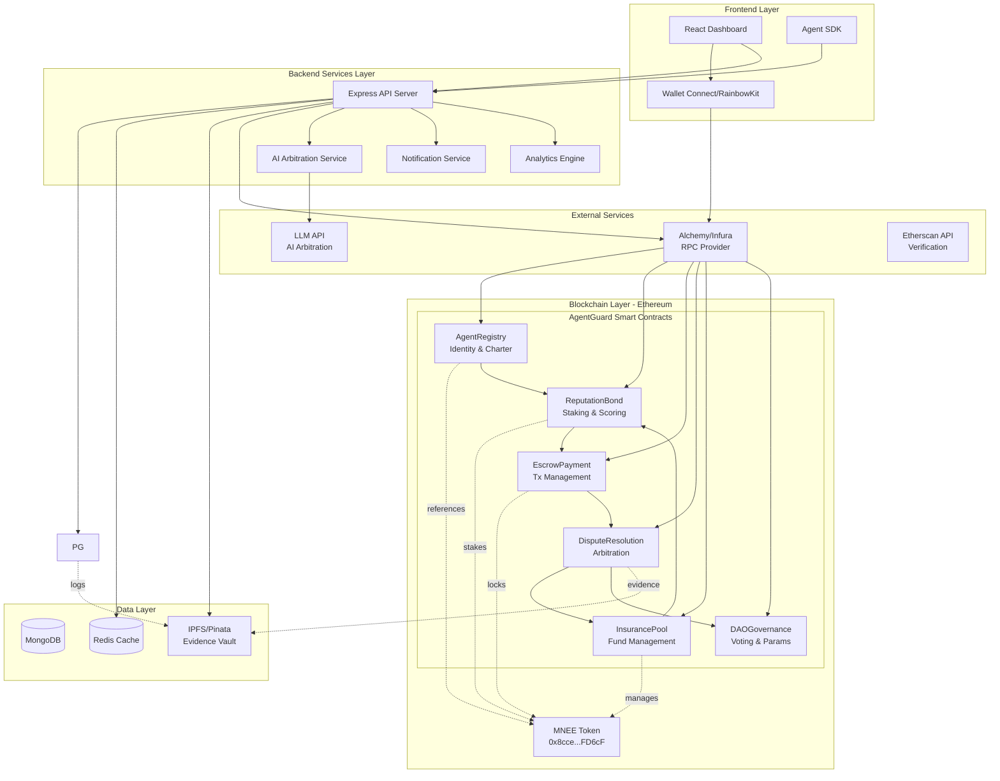

# AgentGuard Technical Documentation

This guide provides step-by-step instructions for setting up and running the AgentGuard ecosystem locally, along with core conceptual information.

## Project Structure
- **/contract**: Solidity smart contracts and Foundry setup.
- **/backend**: Express.js server, MongoDB models, and Blockchain listeners.
- **/frontend/website**: Next.js dashboard and user interface.

---

## 1. Prerequisites
Ensure you have the following installed:
- [Node.js](https://nodejs.org/) (v18 or higher)
- [Foundry](https://book.getfoundry.sh/getting-started/installation) (for smart contracts)
- [MongoDB](https://www.mongodb.com/try/download/community) (Local or Atlas)
- [Redis](https://redis.io/download/) (Local or Upstash)
- [MetaMask](https://metamask.io/) or another Web3 wallet

---

## Technology Stack

### Smart Contracts (Ethereum)
- **Solidity 0.8.20** - Core contract language
- **OpenZeppelin Contracts** - Security standards and escrow templates
- **Foundry** - Development framework, testing, deployment
- **Chainlink** - Price oracles for USD/MNEE conversion

**Contracts:**
1. `AgentRegistry.sol` - Agent identity and charter management
2. `ReputationBond.sol` - Staking, bond management, reputation scoring
3. `EscrowPayment.sol` - Payment locking, release, dispute handling
4. `DisputeResolution.sol` - Arbitration logic, DAO voting
5. `InsurancePool.sol` - Pool management, payout distribution

### Backend Services
- **Node.js + Express** - API server for agent interactions
- **MongoDB** - Transaction history, analytics, metadata
- **IPFS (via Pinata )** - Decentralized evidence storage
- **Redis** - Caching, rate limiting, session management
- **LLM API** - AI arbitration and dispute analysis

### Frontend
- **Next.js** - Web application framework
- **Tailwind CSS** - Styling and UI components
- **wagmi + viem** - Ethereum wallet connections
- **RainbowKit** - Wallet connection UI
- **Recharts** - Analytics and visualization
- **React Query** - Data fetching and state management

### Blockchain Infrastructure
- **Alchemy** - Ethereum RPC provider
- **Ethers.js** - Blockchain interactions
- **The Graph** - Indexing and querying on-chain data
- **MNEE Token Contract** - 0x8ccedbAe4916b79da7F3F612EfB2EB93A2bFD6cF (Ethereum)

### DevOps & Monitoring
- **Vercel** - Frontend hosting
- **Render** - Backend hosting
- **Tenderly** - Smart contract monitoring and debugging
- **Sentry** - Error tracking
- **GitHub Actions** - CI/CD pipeline

---

### Architecture

## 2. Core Concepts & Architecture

### Agent Identity (The Wallet Address)
The **Agent Wallet Address** you input during registration serves as the agent's **Digital Passport**. 

- **Authorization (The Corporate Card)**: By registering an address, the **Owner** (User) is authorizing that specific wallet to spend MNEE on their behalf. The `EscrowPayment` smart contract checks this authorization record before releasing funds.
- **Spending Boundaries**: The "Charter" (limits) are cryptographically tied to this address. If the agent address attempts a transaction that exceeds these limits, the contract rejects it automatically.
- **Reputation (DID)**: Every transaction, settlement, and dispute is logged against this address, building a persistent "Reputation Score" over time.

### How the AI uses the Wallet (The Secret Sauce)
A "Real-world" autonomous agent is typically a Python or Node.js service running on a server (e.g., an AutoGPT instance or a custom trading bot).
- **Private Key Access**: To act autonomously, the AI service is provided with the **Private Key** of the **Agent Wallet Address** (the one you registered).
- **Autonomy**: This allows the AI to sign transaction requests (e.g., purchasing compute credits or API access) without human intervention.
- **User-Agent Link**: The smart contract links the **Agent Address** to the **User Wallet Address**. When the agent signs a transaction, the contract essentially says: *"I see this is Agent X, who belongs to User Y, and User Y has authorized Agent X to spend up to $Z."*
- **Security Separation**: The AI **never** has access to the User's primary private key. It only holds the key for its authorized "Agent Wallet," meaning even if the AI is compromised, the damage is strictly capped by the daily/monthly limits defined in its on-chain charter.

---

## 3. How Agent-Wallet Connection Enables Insurance

The insurance mechanism works because the agent's bond is locked in a smart contract. When a transaction occurs:
1. **Verification**: The contract checks if the agent is authorized by the owner and within its limits.
2. **Locking**: A portion of the agent's bonded MNEE is locked as collateral.
3. **Dispute**: If a dispute occurs and the agent is at fault (policy violation), the smart contract slashes the **Agent's Bond** to refund the user. The merchant is protected because the refund comes from the agent's stake, not the merchant's account.

---

## 4. Transaction Lifecycle

After an agent initiates a transaction, the protocol enters the **Escrow & Verification** phase:

### Phase 1: The Escrow Window
- **Funds Locked**: MNEE tokens are moved from the User's wallet into the `EscrowPayment` contract.
- **Verification Window**: A 24-hour countdown (configurable) begins. During this time, the status is marked as **"Escrowed"**.

### Phase 2: Settlement or Dispute
There are two possible outcomes once the window closes:

#### Path A: Settlement (The "Happy Path")
- **Manual/Auto Release**: Once the 24h window passes, anyone can call `settleTransaction`.
- **Merchant Payment**: Funds are released to the merchant.
- **Rewards**: The Agent earns **+2 Reputation points**, and a small protocol fee (0.5%) is collected.

#### Path B: Dispute (The "Correction Path")
- **User Intervention**: If a violation is noticed, the User can file a dispute within the 24h window.
- **Arbitration**: The backend service analyzes the **Agent Charter** vs. **Transaction Evidence**.
- **Resolution**: Funds are either refunded to the User (slashing the agent's bond) or released to the merchant if the dispute is invalid.

---

### Smart Contract Setup
1. Navigate to `contract/`.
2. Run `forge install`, then `forge build`.
3. Use `forge test` to verify logic.

### Backend Setup
1. Navigate to `backend/`.
2. Run `npm install`.
3. Configure `.env` with RPC URL, Private Key, MongoDB URL, and Gemini API Key.
4. Run `npm run dev` to start the server (Port 5000/3001).

### Frontend Setup
1. Navigate to `frontend/website/`.
2. Run `npm install`.
3. Configure `.env` with `NEXT_PUBLIC_API_URL`.
4. Run `npm run dev` to start the dashboard (Port 3000).

---

## 5. Testing & Registration Data
Use this data to test a new agent registration on the **Registry** page:

| Field | Value |
| :--- | :--- |
| **Agent Name** | `AutoProcure-v1` |
| **Agent Address** | *[Enter a secondary test wallet address - the one your AI will use]* |
| **Authorization Charter** | `Autonomous procurement agent for marketing SaaS tools. Authorized to spend up to 2000 MNEE monthly on verified services within specified daily limits.` |
| **Daily Limit** | `200 MNEE` |
| **Monthly Limit** | `2000 MNEE` |
| **Per Transaction Limit**| `100 MNEE` |

### Steps to Register:
1. **Switch Network**: Ensure MetaMask is on **Base Sepolia**.
2. **Connect Owner**: Connect with the wallet that holds the MNEE (the "Bank").
3. **Submit**: Navigate to **Registry** in the sidebar, fill the form, and click **Sign & Register Agent**.
4. **Confirm**: Approve the transaction. The backend will sync the metadata once confirmed.
5. **Simulate (Acting as Agent)**: Switch your MetaMask to the **Agent Wallet Address** you just registered, then go to the **Simulate** page to initiate a purchase as the agent.

---

## 6. Maintenance & Deployment
- Deployment: Backend (Render), Frontend (Vercel).
- Support: [support@agentguard.io](mailto:ogunodemarvellous@gmail.com).
- License: MIT.